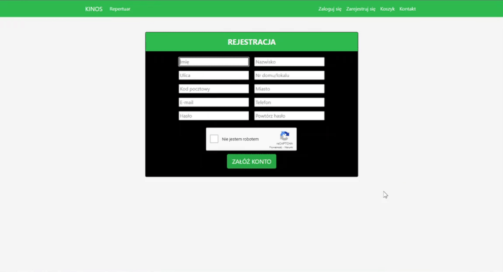

# KINOS
My first web application was typed in HTML/Twig, partly JavaScript (front-end) and PHP (back-end).
This application was made in collaboration with Kacper Jabłoński and Maksymilian Dziadoń (we were all developing front-end and back-end but I have created the database). The project was done as part of the coursework for module Bazy danych (eng. Databases) during the 5th term of ICT studies (AGH, Kraków, Poland).

## Overview
This is a web application that allows to purchase cinema tickets.
Application has been secured against buying the same seats by different users and attacks such as SQL injection or XSS.
The description below presents the features of the application. 

#### Main page and contact
 

The **main page** features movie posters that are changing periodically. 
Once you click on a movie poster, you will be taken to a new page displaying the movie’s details.
Additionally, on the **Kontakt (eng. contact) tab** you can find contact form, the company information and a map.

#### Repertoire

On the **Repertuar (eng. repertoire) tab** you can see currently played movies. This subpage has a search engine that filters movies based on the title (or its part), genre and age restrictions (e.g. when you want to display only children movies).
Additionally, you can choose a sorting criterion. As a default, the page displays all movies that are currently being shown in the cinema. When movies are no longer played, they are automatically removed from the page.  
   
#### Registration, login and my account

Registration isn't required to purchase tickets. However, having an account makes the payment process easier, as customer data is filled in automatically.
On **Moje konto (eng. my account) tab** you have access to your purchase history, and you can change your personal data, password or delete the account.

#### Tickets booking

To purchase tickets, go to the **chosen movie's tab** and select the screening by clicking on **Rezerwuj bilet (eng. book ticket) button**. You can purchase tickets 30 minutes before the screening at the latest and up to 7 days ahead.
Next, you choose seats (if they are unoccupied) and then click on **Dodaj do koszyka (eng. add to cart) button**. Additionally, you can add to the cart a lot of tickets for various movies and screenings.
In the last step, you have to give personal data, choose a way of delivery and payment, solve reCAPTCHA and... DONE! Your tickets have been booked.

## How to launch app
* Download repository
* Install [AMPPS](https://ampps.com/downloads/) (or other package containing Apache module and MySQL database)
* Launch database interface phpMyAdmin and sign in
	- login: root
	- password: mysql
* Create a new database named **kinos** and import database dump which is available in this repository
* Make AMPPS www catalog empty and then copy there the content of www catalog from this repository
* Go to the web page by typing in a browser: localhost, 127.0.0.1 or your PC's IP address 

* WARNING: Probably neither movie nor screening won't be available now so you can add new movies and screenings to database or edit SQL queries in the code.
